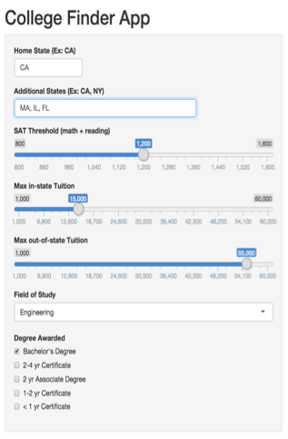
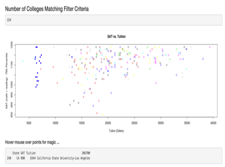
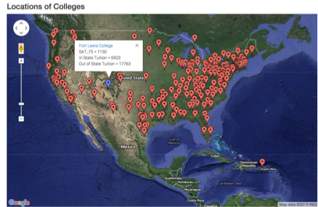

## Entering college finder selection criteria : Example

- enter your selections on this left sidebar pane as shown below
- The data used for this app is obtained from the US Dept of Education site [here](https://collegescorecard.ed.gov/data/) 

---

## Results shown on the main panel

   * Number of colleges matching the selection criteria (if > 0, below 2 plots also shown)
   * SAT -vs- Tuition plot : hover mouse on a point for name of college
   * Locations of colleges : click on the school name in tool-tip for college info

    

